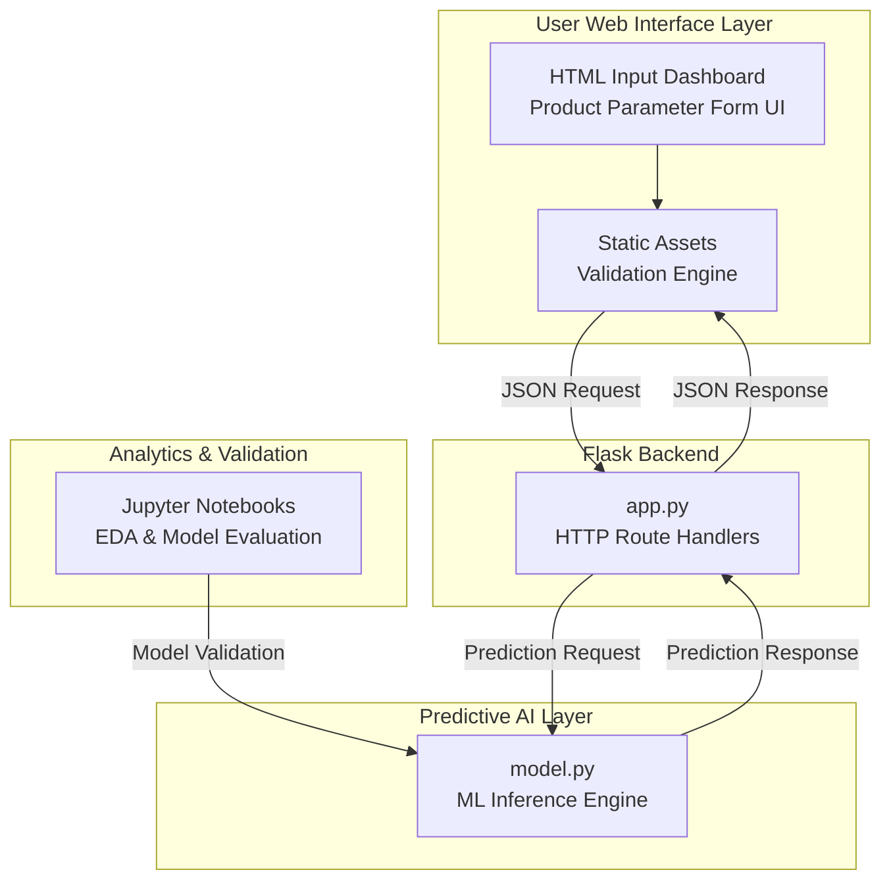
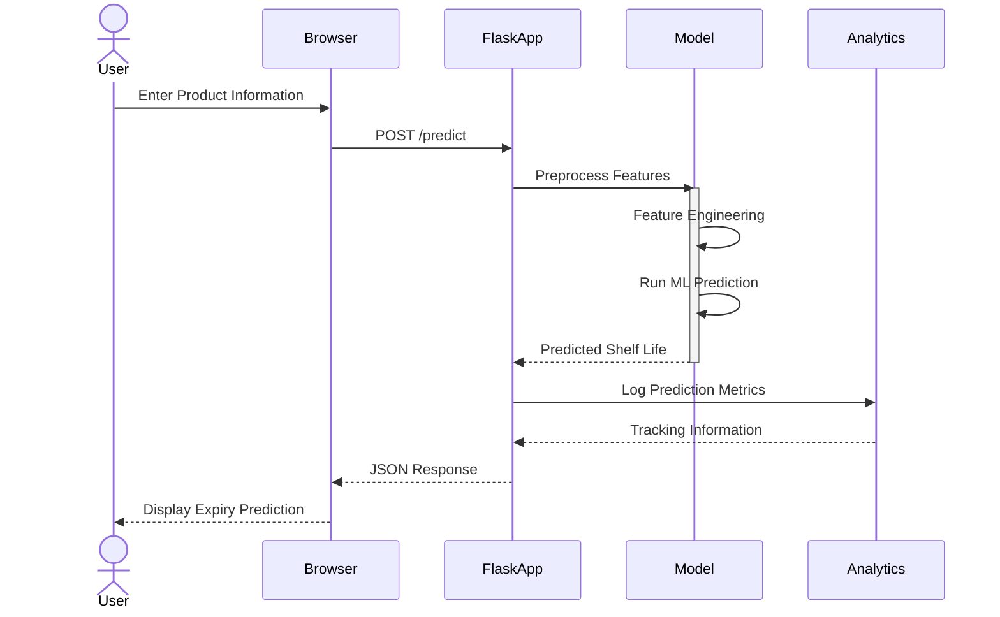
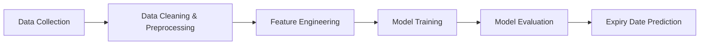
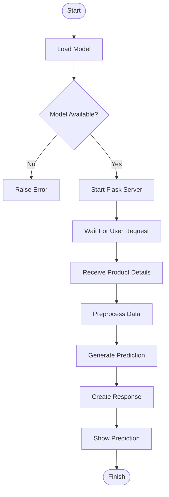

<p align="center">
  
</p>

<div align="center">


<br/>

### 🧪 Smart AI Shelf-Life Prediction Platform

**By [Ajinkya Ghuge](https://github.com/Ajinkya-Ghuge)**

*An AI-powered intelligence platform built to predict the expiry dates and shelf stability of food and pharmaceutical products using machine learning.*

<br/>

[](https://python.org)
[](https://flask.palletsprojects.com)
[](https://scikit-learn.org)
[](https://pandas.pydata.org)

<br/>

> *"No more manual tracking or guesswork. Just smart, accurate stability predictions based on data."*

</div>

---

## 📋 Table of Contents

| # | Section |
|---|---------|
| 1 | [Project Overview](#-project-overview) |
| 2 | [Key Features](#-key-features) |
| 3 | [System Architecture](#-system-architecture) |
| 4 | [Machine Learning Pipeline](#-machine-learning-pipeline) |
| 5 | [Project Workflow](#-project-workflow) |
| 6 | [Tech Stack](#-tech-stack) |
| 7 | [Project Structure](#-project-structure) |
| 8 | [Installation & Local Setup](#-installation--local-setup) |
| 9 | [API Reference](#-api-reference) |

---

## 🎯 Project Overview

Manual tracking and guesswork regarding product expiration lead to massive inventory losses, safety risks, and operational waste. The **Expiry Date Predictor** acts as an automated solution that evaluates intricate raw feature variables—such as dynamic ingredients, volatile packaging materials, and active storage environment conditions—to forecast an exact, data-backed shelf life duration matrix.

### Core Objectives
- 🧾 **Minimize Resource Waste:** Assists production facilities in mitigating supply chain decay through preventative timelines.
- 🛡️ **Optimize Safety Assurance:** Provides chemical, pharmaceutical, and consumable goods providers with predictive safety safety nets.
- 📦 **Streamline Inventory Flow:** Equips warehouse managers with accurate predictive indices for first-expired, first-out (FEFO) strategies.

---

## ✨ Key Features

- 🔍 **Multi-Variable Feature Analysis:** Aggregates multi-dimensional product configurations (e.g., compounding components, air exposure profiles, baseline temperature bounds).
- 🧠 **Advanced Regression Inference:** Uses trained scikit-learn estimators to convert dynamic environmental thresholds into real-time shelf life counts.
- 📊 **Insightful Exploratory Dashboards:** Packaged alongside exploratory rendering matrices utilizing Matplotlib and Seaborn for dataset profiling.
- 🔌 **API Integration Layer:** Exposes modular HTTP service routes designed to accept payload vectors and stream instantaneous predictions out to client ERP nodes.

---

## 🏗️ System Architecture

### Component Diagram



---

## 🔄 Request Flow



---

# 🤖 Machine Learning Pipeline



---

# 🚀 Project Workflow



---

# 🛠️ Tech Stack

| Category         | Technology          | Purpose           |
| ---------------- | ------------------- | ----------------- |
| Language         | Python 3.8+         | Core Development  |
| Backend          | Flask               | Web Application   |
| Data Processing  | Pandas, NumPy       | Data Manipulation |
| Machine Learning | Scikit-Learn        | Prediction Models |
| Visualization    | Matplotlib, Seaborn | Analytics         |
| Experimentation  | Jupyter Notebook    | Model Training    |

---

# 📂 Project Structure

```plaintext
expiry-predictor/
│
├── data/
│   └── datasets/
│
├── static/
│   ├── css/
│   ├── js/
│   └── images/
│
├── templates/
│
├── notebooks/
│
├── app.py
├── model.py
├── constraint.py
├── requirements.txt
└── README.md
```

---

# ⚡ Installation & Local Setup

## Prerequisites

* Python 3.8+
* pip

## Clone Repository

```bash
git clone https://github.com/Ajinkya-Ghuge/Datasphere.git

cd Datasphere
```

## Create Virtual Environment

```bash
python -m venv venv
```

Windows:

```bash
venv\Scripts\activate
```

Linux/macOS:

```bash
source venv/bin/activate
```

## Install Dependencies

```bash
pip install -r requirements.txt
```

## Run Application

```bash
python app.py
```

Open:

```text
http://localhost:5000
```

---

# 🔌 API Reference

| Method | Endpoint | Description         |
| ------ | -------- | ------------------- |
| GET    | /        | Load Dashboard      |
| POST   | /predict | Predict Expiry Date |

### Example Request

```json
{
  "temperature": 25,
  "humidity": 60,
  "packaging": "Plastic",
  "ingredients": "Milk Powder"
}
```

### Example Response

```json
{
  "predicted_shelf_life_days": 365,
  "confidence_score": 0.94
}
```

---

<div align="center">

## 👤 Author

### Ajinkya Ghuge

GitHub: https://github.com/Ajinkya-Ghuge

⭐ Star this repository if you found it useful!

</div>
